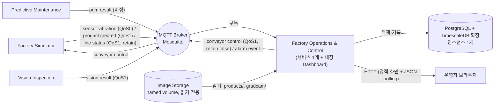
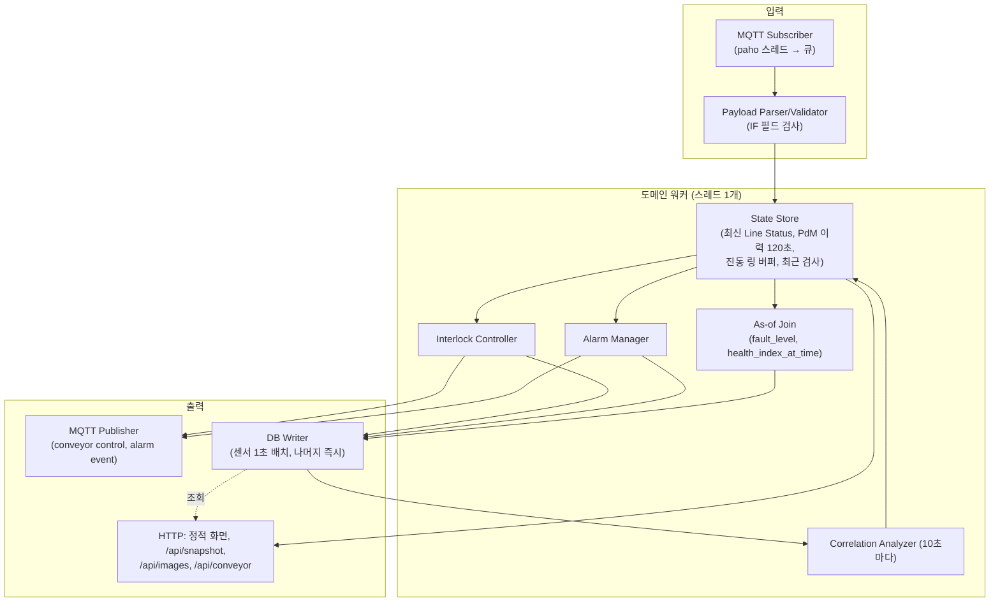
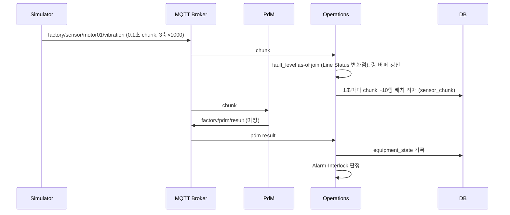
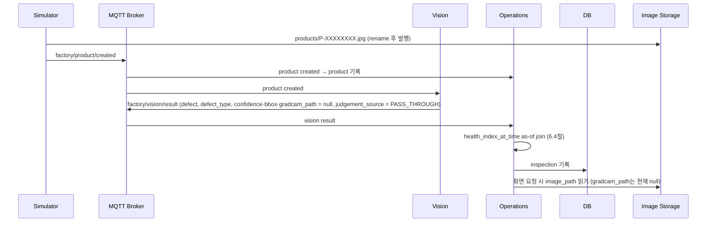
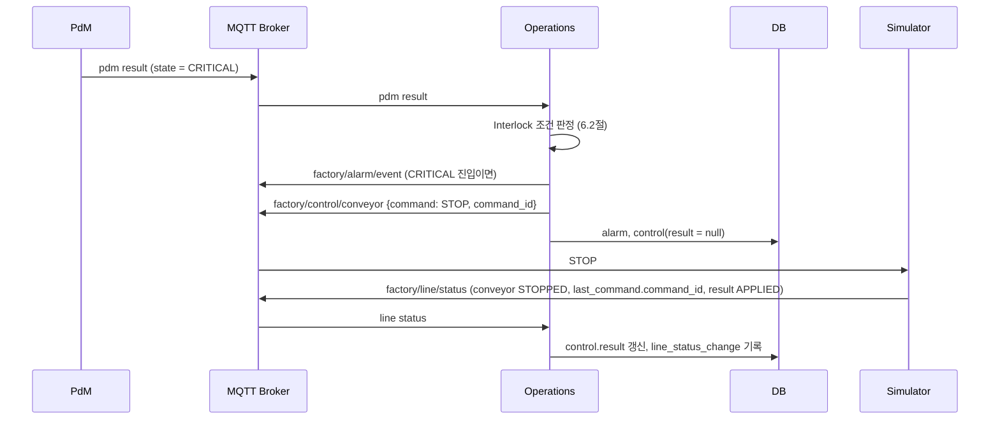

# Factory Operations & Control — Component Architecture (초안)

> 상태: **배경 문서(초안)**. 구현 기준은 다음 단계에서 쓰는 `docs/spec/`이다(조율 결정 C-02). spec과 다르면 spec을 따른다.
> 리뷰: Codex 리뷰 1회를 반영했다. 판정 기록은 `docs/reviews/architecture-codex-1.md`.
> 계약 기준: `SHARED_CONFIG.json`의 `contract_ref`는 아직 `null`이다. 조율 결정 C-04에 따라 Shared에 **확정**된 Interface(Sensor Vibration, Product Created, Vision Result, Conveyor Control, Line Status)와 CONVENTIONS는 아래 commit의 내용을 구현 기준으로 쓴다. `contract_ref` 채택은 C-05에 따라 필요한 Interface가 모두 확정된 뒤 별도 task로 한다.

## 0. 읽은 기준과 표기

### 0.1 Shared 참고 기준

| 항목 | 값 |
|---|---|
| Shared 저장소 | `dltndn-personal-project/smart-factory-shared-repository` (원격, GitHub Contents API) |
| 읽은 ref | 원격 기본 브랜치 `main`의 commit `d0c997c97129141d9853a42ce6e0d1f8f7309ae9` (2026-09-27 조회, 90-shared.md 2절 방식) |
| 읽은 문서 | `docs/ARCHITECTURE.md`, `docs/INTERFACES.md`, `docs/CONVENTIONS.md` |
| `contract_ref` | `null`. 위 머리말의 C-04·C-05 처리 |
| 함께 맞춘 문서 | factory-simulator `docs/spec/AGREEMENTS.md` A-01~A-12, `docs/spec/05-mqtt.md` (완료된 Component. Operations가 그 동작에 맞춘다, C-00) |
| 읽지 않은 것 | Shared Issue 목록·본문, 로컬 `../shared-repository/` 폴더 |

초안의 첫 판은 `6bcd2aad8e374a7e96f816051585a49cb5e30f86` 기준이었다. 그 뒤 Shared에서 다섯 Interface와 Timestamp·ID·열거값·단위·실행 방식이 확정되어 이 판에서 모두 다시 맞췄다.

### 0.2 표기

- **[확정]** Shared 문서에 근거가 있는 내용. 괄호 안에 출처 절을 적는다. (ARCH 4.4) = Shared `docs/ARCHITECTURE.md` 4.4절, (IF) = `docs/INTERFACES.md`, (CONV) = `docs/CONVENTIONS.md`, (SIM A-xx) = factory-simulator `AGREEMENTS.md`.
- **[결정]** Shared에 근거가 없어 이 Component가 정한 설계. spec 단계에서 세부를 고정한다.
- **[미정]** 다른 Component나 Shared의 결정을 기다리는 항목. 11절에 모았다.

---

## 1. 목적과 역할

Factory Operations & Control(이하 Operations)은 Smart Factory System의 **중앙 운영 Component**다. PdM과 Vision의 분석 결과와 Simulator의 설비·생산 이벤트를 수집해 공장 운영 상태를 관리하고, **생산라인 제어 권한**을 가진다. [확정] (ARCH 4.4)

> Integration + Monitoring + Decision + Control (ARCH 4.4)

여기서 Integration은 **Runtime 데이터 통합**이다. 저장소 조합·호환성 검증을 하는 `integration` 저장소와는 다른 책임이다. [확정] (ARCH 19.1)

toy(교육용 PoC) 범위다. HA, 보안, 재시도·복구, 멱등성, 대규모 성능은 설계하지 않는다. [확정] (ARCH 2, 12, 13)

---

## 2. 책임 범위와 경계

### 2.1 책임 (하는 일)

| 영역 | 내용 | 근거 |
|---|---|---|
| 데이터 통합 | Simulator(Sensor Vibration, Product Created, Line Status), PdM(PdM Result), Vision(Vision Result)을 MQTT로 수신 | [확정] ARCH 4.4 Data Integration, IF |
| 시간 동기화 | timestamp와 `sensor_id`·`product_id`로 설비 데이터와 품질 데이터를 연결(6.4, 6.6절) | [확정] ARCH 4.4, 9 / 결합 규칙 [결정] |
| 상관분석 | 설비 상태 지표와 제품 불량의 관계(Pearson, Spearman, Time Lag), Dashboard 표시(6.8절) | [확정] ARCH 4.4, 17 / 방법 [결정] |
| Alarm 관리 | Equipment State 변화에서 Alarm 생성(WARNING·CRITICAL 필수), Alarm History 저장, Alarm Event 발행(6.3절) | [확정] ARCH 4.4 / 규칙 [결정] |
| Interlock 제어 | CRITICAL이면 Conveyor Control `STOP` 발행. 라인 정지 결정 권한은 Operations만 가짐. 운영자 `START`도 Operations가 발행(6.2절) | [확정] ARCH 4.4, 7.3, 17, IF Conveyor Control / 규칙 [결정] |
| Dashboard | 실시간 통합 관제 화면, 5초 이내 갱신(9절) | [확정] ARCH 2, 4.4 |
| 데이터 영속화 | DB 테이블 스키마(DDL) 소유, DB에 기록하는 **유일한** Component(7절) | [확정] ARCH 4.4 Data Persistence, 5.2, 5.3 |
| Ground Truth | 평가 용도로만 사용 ("Evaluation Only"). Line Status의 `fault_level`은 표시·저장·평가에만 사용 | [확정] ARCH 8, 17, IF Line Status |

### 2.2 하지 않는 일

| 하지 않는 일 | 담당 | 근거 |
|---|---|---|
| FFT, Feature Extraction(RMS 등 진동 특징 포함), Health Index 계산 | PdM | [확정] ARCH 17 |
| Defect Detection, Grad-CAM 생성 | Vision (현재 범위: pass-through, Grad-CAM 없음) | [확정] ARCH 4.3, 17 |
| Fault Injection, 센서·제품·이미지 생성, Conveyor 물리적 정지 | Simulator | [확정] ARCH 4.1, 17 |
| 3D Factory Visualization | Simulator ("Dashboard Only") | [확정] ARCH 17 |
| 다른 Component 코드 의존·HTTP 호출 | 금지. MQTT로만 연동(simulator의 로컬 HTTP API도 호출하지 않음) | [확정] ARCH 10, SIM A-17 |
| 시스템 compose, Broker·DB·볼륨 실행 정의, 조합 검증, 시스템 수준 성능 측정 | `integration` | [확정] ARCH 19.1, CONV |
| 이미지·Ground Truth 파일 기록 | Simulator, Vision. Operations는 `products/`, `gradcam/`를 읽기만 | [확정] IF Image Reference |
| Ground Truth(`fault_level`, `ground_truth/products.jsonl`)를 Interlock·Alarm·상관분석 입력으로 사용 | 금지 | [확정] ARCH 8, 17 |

### 2.3 소유하는 데이터·자원

- DB 스키마 파일 `db/schema.sql`과 모든 테이블 기록 [확정] (ARCH 4.4, 5.2, 5.3). 형식과 초기화 방식은 7.3절 [결정], integration 합의는 11절 O-4.
- Conveyor Control 메시지의 **생산자** [확정] (IF)
- Alarm Event의 **생산자**. Payload는 Operations가 확정해 Shared에 올린다 [확정: 조율 C-04] / 초안은 6.3절 [결정]

---

## 3. 시스템 컨텍스트



근거: ARCH 4.4, 5, 7 / IF Interface 목록, Image Reference. DB 구성은 7.1절, 화면 전달은 9절 [결정].

---

## 4. 내부 구성요소

### 4.1 모듈 구조 [결정]

Python 3.12 프로세스 하나다. paho 네트워크 스레드는 받은 메시지를 큐에 넣기만 하고, **도메인 워커 스레드 하나**가 순서대로 처리한다(상태 갱신, 판단, DB 쓰기, 발행). HTTP 서버는 같은 프로세스에서 상태 저장소의 스냅숏과 DB 조회로 응답한다. 락은 상태 저장소 하나에만 둔다.



| 모듈 | 책임 |
|---|---|
| MQTT Subscriber | 6.1절 Topic 구독. Line Status는 retain으로 연결 직후 현재 값을 받는다 |
| Parser/Validator | IF의 필수 필드·형식 검사. `schema_version`이 1이 아니거나 필수 필드가 없으면 로그 후 폐기. 모르는 필드는 무시 (CONV) |
| State Store | 최신 Line Status(또는 offline), Line Status 변화점 목록, `sensor_id`별 PdM 결과 120초, 진동 chunk 링 버퍼 20개(2초), 최근 검사 20개, 대기 중인 명령 |
| As-of Join | 센서 chunk에 `fault_level`, 검사 결과에 `health_index_at_time`을 붙임(6.4절) |
| Alarm Manager | 상태 전이 판정, Alarm 기록·발행(6.3절) |
| Interlock Controller | STOP 발행 판정과 명령 결과 확인(6.2절) |
| Correlation Analyzer | DB의 검사·설비 상태 이력으로 상관계수와 Time Lag 계산(6.8절) |
| DB Writer | 7절 테이블 기록. 중복 키는 `ON CONFLICT DO NOTHING` |
| HTTP | 9절 |

순수 로직(Interlock, Alarm, As-of Join, 상관분석, Payload 파싱·생성)은 MQTT·DB 없이 단위 테스트할 수 있게 입출력만 받는 함수·클래스로 둔다.

### 4.2 저장소 디렉터리 구조 [결정]

spec에서 확정하고 BOOT-1(조율 C-09)에서 `docs/COMPONENT.md` "구조" 절에 옮긴다.

```text
factory-operations/
├─ docs/                          # COMPONENT.md, ARCHITECTURE.md, spec/, plan/, reviews/
├─ db/schema.sql                  # DDL (integration이 DB 초기화에 사용, 7.3절)
├─ src/factory_operations/
│  ├─ mqtt/                       # client(paho만 import), payloads(순수 함수)
│  ├─ domain/                     # state, interlock, alarm, join, correlation
│  ├─ store/                      # DB writer·조회 (psycopg)
│  └─ web/                        # HTTP 앱, static/(index.html, app.js, vendor/차트 라이브러리)
├─ config/                        # .env.example, config.example.yaml (실제 .env는 commit하지 않음)
├─ tests/unit/, tests/integration/ (Component 테스트용 compose 포함)
├─ Dockerfile
└─ agent/                         # 기존
```

---

## 5. 데이터 흐름

### 5.1 센서 데이터 흐름 (ARCH 7.1)



### 5.2 Vision 검사 흐름 (ARCH 7.2, 현재 범위 pass-through)



Vision Result의 `timestamp`는 Product Created의 캡처 시각 그대로다(IF). Topic 사이의 도착 순서는 보장되지 않으므로 Vision Result가 Product Created보다 먼저 올 수 있다. 두 테이블은 외래키 없이 `product_id`로 조인한다.

### 5.3 생산 제어(Interlock) 흐름 (ARCH 4.4, 7.3)



---

## 6. 외부 인터페이스와 판단 규칙

### 6.1 구독 (Consume)

| Interface | Topic | QoS / retain | 생산자 | Operations에서의 용도 | 상태 |
|---|---|---|---|---|---|
| Sensor Vibration | `factory/sensor/+/vibration` | 0 / false | factory-simulator | `sensor_chunk` 적재, 실시간 진동 표시 | [확정] (IF, SIM A-03) |
| Product Created | `factory/product/created` | 1 / false | factory-simulator | `product` 기록, 생산 수 | [확정] (IF, SIM A-06) |
| PdM Result | `factory/pdm/result` | 미정 | predictive-maintenance | 설비 상태 표시, Alarm, Interlock, 상관분석 | [미정] (11절 O-1) |
| Vision Result | `factory/vision/result` | 1 / false | vision-inspection | `inspection` 기록, 불량률, 상관분석 | [확정] (IF) |
| Line Status | `factory/line/status` | 1 / **true** | factory-simulator | Conveyor Status, Current Fault Level, 생산 진행, 명령 결과 확인, `fault_level` as-of join | [확정] (IF, SIM A-12) |

접두사 `factory`는 설정으로 받는다(IF). 구독 QoS는 1로 한다(센서는 발행 QoS 0이므로 0으로 전달된다).

필드 요지(원본은 IF, 여기서는 Operations가 쓰는 것만):

- **Sensor Vibration**: `schema_version`, `sensor_id`, `timestamp`(첫 샘플 시각), `seq`, `sample_rate_hz`(10000), `rpm`, `temperature`, `vibration_x/y/z`(각 1000개, g). `fault_level`은 **없다**(SIM A-04). 약 25 KB, 초당 10개. 정지 중에도 `rpm: 0.0`으로 계속 온다(SIM A-05).
- **Product Created**: `product_id`, `timestamp`(캡처 시각), `image_path`. 투입(불량 결정) → 캡처는 기본 약 13.3초(IF).
- **Vision Result**: `product_id`(필수), `timestamp`, `defect`, `defect_type`(소문자 또는 null), `confidence`·`bbox`·`gradcam_path`(현재 항상 null, 키는 있음), `image_path`, `judgement_source`(선택, 현재 `PASS_THROUGH`). 같은 제품이 두 번 올 수 있다.
- **Line Status**: 두 형태를 모두 받는다. (a) 정상: `online: true`, `timestamp`, `conveyor`(`RUNNING`|`STOPPED`), `fault_level`(0~10), `motor_rpm`, `sensor_id`, `production_active`, `products{spawned, created, expired, in_flight, last_product_id}`, `last_command`(null 또는 `{command, command_id, source, received_at, result, reason, error}`). (b) offline: `{"schema_version":1,"online":false}`만 있다(LWT 또는 정상 종료, retain). 상태 변화 시 즉시, 그 외 1초마다 온다.

### 6.2 발행 (Produce)과 Interlock 규칙

#### Conveyor Control [확정] (IF, SIM A-11)

Topic `factory/control/conveyor`, QoS 1, **retain false**(simulator는 retained 명령을 `REJECTED`로 버린다).

```json
{"schema_version": 1, "command": "STOP", "command_id": "<UUID4>", "timestamp": "2026-09-25T05:21:00.012Z", "reason": "INTERLOCK_CRITICAL"}
```

- `command`: `START` | `STOP`. `command_id`: 명령마다 새 UUID4. `timestamp`: **명령 발행 시각**(Operations 호스트 UTC, 밀리초 3자리, 버림). `reason`: `INTERLOCK_CRITICAL` 또는 `OPERATOR_START`/`OPERATOR_STOP` [결정].
- 결과는 별도 응답 없이 Line Status `last_command`의 `command_id`·`result`(`APPLIED`|`NO_CHANGE`|`REJECTED`)로 확인한다.

#### Interlock 규칙 [결정]

라인은 하나이고 센서도 하나다(현재 `motor01`, Line Status `sensor_id`가 기준. 없으면 설정 `line.sensor_id`). 입력은 PdM Result와 Line Status이며 **둘 중 하나가 올 때마다** 아래를 평가한다.

1. **판정 대상 상태**: 라인 센서의 가장 최근 PdM Result 중 `timestamp`가 **기준 시각** 이후인 것. 기준 시각은 마지막으로 `conveyor`가 `STOPPED`(또는 알 수 없음) → `RUNNING`으로 바뀐 것을 본 Line Status의 `timestamp`다. 재가동 전에 받은 CRITICAL(정지 중에는 PdM이 새 결과를 내지 않아 오래 남는다)로 재가동 직후 다시 멈추지 않게 하기 위해서다. 기동 직후 기준 시각은 없음(모든 결과 유효).
2. **STOP 조건**: 판정 대상 상태가 `CRITICAL`이고, 라인 상태가 `RUNNING` 또는 **알 수 없음**(Line Status 미수신, `online: false`)이고, **대기 중인 STOP이 없을 때** STOP을 발행한다. 알 수 없을 때 보내는 것은 안전 쪽 선택이다(이미 정지면 simulator가 `NO_CHANGE`).
3. **대기 중인 STOP**: 발행한 STOP의 `command_id`가 Line Status `last_command`에 아직 나타나지 않았고 발행 뒤 `interlock.pending_timeout_s`(기본 5초)가 지나지 않은 것. 결과를 보거나 시간이 지나면 대기가 끝난다. 같은 CRITICAL 결과가 계속 와도(PdM 초안은 0.5초마다) STOP은 한 번만 나가고, 결과를 못 받으면 5초 뒤 한 번 더 나간다.
4. **CRITICAL 중 RUNNING 관측**: simulator 재기동(항상 `RUNNING`으로 기동, SIM A-11)이나 simulator 로컬 HTTP의 START로 라인이 다시 돌면 1번 기준 시각이 새로 잡히므로, 그 뒤 PdM이 다시 CRITICAL을 내면 2번에 따라 다시 멈춘다(PdM 초안의 1초 윈도우 기준 재가동 후 약 1~2초).
5. **START**: Operations는 자동으로 START하지 않는다. 운영자가 Dashboard 버튼으로만 보낸다(`reason: OPERATOR_START`). 판정 대상 상태가 CRITICAL이어도 막지 않되 화면에 경고한다. Fault Level을 낮추는 것은 simulator 화면에서 사람이 한다.
6. **기록**: Operations가 보낸 모든 명령은 `control`에 발행 즉시 기록하고, Line Status에서 같은 `command_id`를 보면 `result`, `received_at`, `error`를 채운다. 모르는 `command_id`(simulator 로컬 명령 등)가 `last_command`에 나타나면 `origin = observed`로 한 행 추가한다.
7. **지연 목표**: CRITICAL PdM Result 수신부터 STOP 발행까지 1초 이내. Component 테스트로 확인한다(Shared에 수치 없음).

#### Alarm Event [결정, Shared 등록 예정]

Topic `factory/alarm/event`, QoS 1, retain false로 **발행한다**. 현재 소비자는 없지만, integration이 DB에 접근하지 않고 Alarm 흐름(ARCH 7절 Monitoring / Alarm)을 E2E로 확인할 수 있고 발행 비용이 작다. Payload 초안:

```json
{
  "schema_version": 1,
  "alarm_id": "<UUID4>",
  "timestamp": "2026-09-25T05:20:14.300Z",
  "raised_at": "2026-09-25T05:20:14.412Z",
  "sensor_id": "motor01",
  "severity": "CRITICAL",
  "from_state": "WARNING",
  "to_state": "CRITICAL",
  "health_index": 18,
  "anomaly_score": 0.82
}
```

| 필드 | 필수 | 의미 |
|---|---|---|
| `alarm_id` | 예 | UUID4 |
| `timestamp` | 예 | 원인 PdM Result의 `timestamp` 그대로(이벤트 발생 시각, ARCH 9·17) |
| `raised_at` | 예 | Operations가 판정한 시각(호스트 UTC) |
| `sensor_id` | 예 | PdM Result 값 |
| `severity` | 예 | `WARNING` \| `CRITICAL` (= `to_state`) |
| `from_state` | 예 | 이전 상태 또는 null(첫 결과) |
| `to_state` | 예 | Equipment State |
| `health_index`, `anomaly_score` | 예 | 원인 PdM Result 값 |

Shared DOCUMENT_CHANGE는 spec 단계에서 확정한 뒤 별도 subagent가 올린다(조율 C-04).

### 6.3 Alarm 규칙 [결정]

- Equipment State 값: `NORMAL`, `CAUTION`, `WARNING`, `CRITICAL`(대문자) [확정] (CONV). 모르는 값은 로그 후 폐기.
- Operations는 Health Index로 상태를 다시 계산하지 않고 PdM의 `state`를 그대로 쓴다(Health Index는 PdM 책임, ARCH 17).
- `sensor_id`별로 이전 상태를 기억한다. 새 상태가 `WARNING` 또는 `CRITICAL`이고 이전 상태보다 **심각도가 높을 때**(첫 결과 포함) Alarm을 만든다. CAUTION 진입과 회복 방향 전이는 Alarm이 아니며, 모든 PdM Result가 `equipment_state`에 남으므로 이력으로 확인한다.
- 6.2절 1번과 같은 기준 시각(재가동)에서 이전 상태를 비운다. 재가동 뒤 다시 CRITICAL이 되면 새 Alarm이 생긴다.
- 확인(ack)·해제 상태는 두지 않는다. 경계값 근처의 떨림(flapping) 억제는 하지 않는다(PdM의 평활화 책임).

### 6.4 시간 결합 규칙 [결정]

| 결합 | 규칙 | 없으면 |
|---|---|---|
| chunk ↔ `fault_level` | chunk `timestamp` 이하의 `timestamp`를 가진 Line Status 변화점 중 가장 최근 것의 `fault_level` [확정] (IF Sensor Vibration, SIM A-04) | null |
| 검사 ↔ 설비 상태 (`health_index_at_time`) | 라인 센서의 PdM Result 중 `timestamp` ≤ Vision `timestamp`(캡처 시각)인 가장 최근 것. 차이가 `join.max_gap_s`(기본 5초)를 넘으면 쓰지 않음. `anomaly_score_at_time`과 사용한 PdM `timestamp`도 함께 저장 | null |
| 제품 ↔ 센서 | 단일 라인이므로 모든 제품을 Line Status `sensor_id`(없으면 설정값)에 대응 | — |

- 결합은 메시지를 처리하는 순간 메모리에 있는 데이터로 한 번 한다. 늦게 도착한 Line Status·PdM Result로 이미 기록한 행을 고치지 않는다. 오차는 `fault_level`에서 최대 chunk 하나(0.1초, IF), `health_index_at_time`에서 PdM 발행 간격 정도다. toy 범위에서 받아들인다.
- `health_index_at_time`은 Shared 5.3절 필드 이름 그대로 **캡처 시각** 기준이다. 불량은 투입 시점(약 13.3초 전)에 정해지므로 원인 분석은 6.8절 Time Lag로 한다.

### 6.5 Timestamp·ID 정책 [확정] (CONV)

- Timestamp: UTC, ISO 8601, `Z`, **밀리초 3자리 고정**, 밀리초 미만 버림. 정규식 `^\d{4}-\d{2}-\d{2}T\d{2}:\d{2}:\d{2}\.\d{3}Z$`. 수신 값은 바꾸지 않고 저장한다(DB는 `timestamptz`, ms 정밀도 보존).
- Operations가 만드는 timestamp: Conveyor Control은 발행 시각(IF). Alarm Event는 6.2절.
- `sensor_id`: `^[a-z][a-z0-9_]{0,31}$`. `product_id`: `^P-[0-9]{8}$`, Image Storage 볼륨 하나의 수명 동안 유일, 빈 번호 가능. production sequence는 `product_id`의 숫자 부분(별도 필드 없음).
- 형식 위반 메시지는 로그 후 폐기(CONV 오류 표현).

### 6.6 Ground Truth (ARCH 8, 17 / IF Ground Truth)

- Line Status `fault_level`은 Dashboard 표시(Current Fault Level)와 `sensor_chunk.fault_level` 저장에만 쓴다. Interlock·Alarm·상관분석 입력으로 쓰지 않는다.
- `ground_truth/products.jsonl`은 읽지 않는다. Fault Level ↔ 불량률 같은 평가 화면은 선택 항목으로 두고, 둘 경우 "평가(Ground Truth)"로 구분 표시한다.
- Vision Result의 `defect`·`defect_type`은 현재 범위에서 Simulator 정보를 옮긴 값이다(`judgement_source: PASS_THROUGH`). `inspection.judgement_source`에 저장하고 화면에 표시한다. 상관분석은 이 값을 "검사 결과"로 그대로 쓴다(Vision의 판정 결과로서 소비, ARCH 4.4).

### 6.7 Image Reference (IF Image Reference)

- `products/`, `gradcam/`을 **읽기만** 한다. 루트는 설정 `IMAGE_ROOT`. MQTT의 경로는 루트 기준 상대 경로다.
- HTTP `GET /api/images/{path}`는 `products/` 또는 `gradcam/` 아래의 `.jpg`만 돌려준다(`..`·절대 경로 거부). 파일이 없으면 404, 화면은 "이미지 없음".
- `gradcam_path`가 null이면 Grad-CAM 칸은 "현재 범위에서 제공하지 않음"으로 표시한다(ARCH 4.4 Dashboard).

### 6.8 상관분석 [결정]

- **설비 지표**: PdM Result의 `anomaly_score`(보조로 `health_index`). raw 진동의 RMS 등은 Feature Extraction이라 PdM 책임이므로(ARCH 17) Operations는 계산하지 않는다. PdM의 상태 지표 자체가 진동에서 나온 값이다.
- **품질 지표**: 제품별 `defect`(0/1).
- **표본**: 검사된 제품마다 캡처 시각 − lag 시점의 설비 지표를 6.4절과 같은 as-of 규칙(최대 차 5초)으로 붙인다. 붙지 않는 제품은 뺀다.
- **방법**: lag를 0~30초, 1초 간격으로 바꿔 가며 Pearson(점이연 상관)과 Spearman 계수를 구한다. 화면에는 기본 lag `correlation.default_lag_s`(13초, IF Product Created의 투입 → 캡처 약 13.3초)의 계수, |Pearson|이 가장 큰 lag와 그 계수, lag별 계수 곡선을 보인다.
- **보조 차트**: 30초 구간별 평균 `anomaly_score`(lag 적용)와 불량률.
- **범위와 주기**: 서비스 기동 후 전체(설정으로 최근 N분 제한 가능), 10초마다 DB에서 다시 계산.
- **표본 부족**: 표본이 20개 미만이거나 불량·양품 중 한쪽이 없거나 분산이 0이면 계수는 null, 화면에 "표본 부족".
- 라이브러리: numpy, scipy(`scipy.stats.pearsonr`, `spearmanr`).

---

## 7. 저장소와 상태 관리

### 7.1 데이터베이스 구성 [결정]

PostgreSQL 인스턴스 **하나**에 TimescaleDB 확장을 켜고, 센서 시계열과 운영 테이블을 같은 DB에 둔다. Shared가 권장한 두 제품(ARCH 5.2, 5.3)을 모두 만족하면서 연결 설정·컨테이너를 하나로 줄인다. 이미지 후보는 `timescale/timescaledb:<고정 버전>-pg16`이며 실제 정의는 integration이 한다(11절 O-4). `sensor_chunk`만 hypertable로 만든다.

### 7.2 논리 스키마 [결정]

| 테이블 | 키 | 주요 열 | 쓰기 시점 |
|---|---|---|---|
| `sensor_chunk` | (`sensor_id`, `timestamp`) | `seq`, `sample_rate_hz`, `rpm`, `temperature`, `vibration_x/y/z real[]`(각 1000), `fault_level smallint null` | 1초마다 배치 |
| `line_status_change` | (`timestamp`) | `online`, `conveyor`, `fault_level`, `motor_rpm`, `production_active`, `sensor_id` | 첫 수신과 `online`·`conveyor`·`fault_level`·`production_active`가 바뀔 때만(1초 주기 메시지는 저장하지 않음) |
| `product` | `product_id` | `timestamp`, `image_path` | Product Created 수신 |
| `inspection` (Inspection History) | `id`, `product_id` UNIQUE | `timestamp`, `defect`, `defect_type`, `confidence`, `bbox int[]`, `image_path`, `gradcam_path`, `judgement_source`, `sensor_id`, `health_index_at_time`, `anomaly_score_at_time`, `pdm_timestamp_at_time` | Vision Result 수신 |
| `defect_result` (Defect Result) | view | `inspection` 중 `defect = true` | — |
| `equipment_state` (Equipment State History) | (`sensor_id`, `timestamp`) | `anomaly_score`, `health_index`, `state` (+ PdM Result 확정 필드) | PdM Result마다 |
| `alarm` (Alarm History) | `alarm_id` | `timestamp`, `raised_at`, `sensor_id`, `severity`, `from_state`, `to_state`, `health_index`, `anomaly_score` | Alarm 생성 |
| `control` (Control History) | `command_id` | `command`, `reason`, `timestamp`(발행), `origin`(`operations`\|`observed`), `trigger_sensor_id`, `trigger_timestamp`, `result`, `result_received_at`, `error` | 발행 시 INSERT, 결과 확인 시 UPDATE |

- Shared 5.3절 Vision Inspection 최소 필드(`id`, `timestamp`, `product_id`, `image_path`, `defect_type`, `confidence`, `bbox`, `health_index_at_time`)는 `inspection`에 모두 있다. Defect Result는 1:1 검사 결과라 별도 테이블 대신 view로 둔다.
- `product`·`inspection` 사이에 외래키를 두지 않는다(도착 순서 비보장). 중복 수신은 키 충돌 시 무시한다.
- 집계 기준: **불량률 = 불량 검사 수 / 검사 수**(`inspection` 한 소스). 생산 수는 `product` 행 수. Line Status `products.created`는 simulator 누계를 그대로 표시만 하고 DB 집계와 더하지 않는다.
- 유지 기간·삭제 없음. integration이 볼륨과 DB를 함께 초기화한다(IF, SIM A-09).

### 7.3 DDL 형식 [결정]

- `db/schema.sql` 한 파일, 순수 SQL, 반복 실행 가능(`CREATE ... IF NOT EXISTS`, `create_hypertable(..., if_not_exists => TRUE)`). migration 도구는 쓰지 않는다.
- integration은 이 파일을 DB 컨테이너의 `/docker-entrypoint-initdb.d/`에 마운트한다(제안, 11절 O-4). Component 테스트도 같은 파일로 테스트 DB를 만든다.

### 7.4 센서 적재량 [결정]

| 항목 | 값 |
|---|---|
| 입력 | chunk 초당 10개, JSON 약 25 KB → 약 250 KB/초(약 0.9 GB/시간) |
| 저장 단위 | **chunk 한 행**(초당 10행). 샘플 단위 전개는 초당 10,000행이라 쓰지 않는다 (ARCH 5.2가 선택을 Operations에 맡김) |
| 행 크기 | `real[]` 3×1000×4 B ≈ 12 KB + 열·헤더 → 약 120 KB/초, 약 0.44 GB/시간(압축 전), 5분 시연 약 36 MB |
| 쓰기 | 1초마다 모인 행(약 10개)을 한 트랜잭션으로 `executemany`. 실패하면 로그 후 그 배치 버림(재시도 없음, ARCH 12) |
| 정밀도 | 값은 소수 4자리 g(IF)라 `real`(float4)로 충분 |
| 화면용 버퍼 | 메모리 링 버퍼 chunk 20개(2초). 화면에는 최근 1초를 축마다 500점으로 솎아 보냄 |

### 7.5 메모리 상태 [결정]

4.1절 State Store의 내용. 재시작하면 사라진다. 재시작 직후 Line Status는 retain으로 바로 받고, PdM 상태는 다음 결과부터 다시 쌓는다. 자동 복구는 범위 밖이다(ARCH 12).

---

## 8. 배포·실행 형태

| 항목 | 내용 | 상태 |
|---|---|---|
| 실행 환경 | 로컬 macOS + Docker Desktop, 개발·데모 | [확정] (ARCH 2, 13) |
| 공통 실행 방식 | Docker Compose. 시스템 compose는 `integration` 소유 | [확정] (CONV, ARCH 19.1) |
| 이 Component의 제공물 | 저장소 루트 `Dockerfile`(python:3.12-slim), `db/schema.sql`, 환경 변수 목록, 포트 | [결정] |
| 프로세스 | 컨테이너 1개, 프로세스 1개(MQTT·도메인·HTTP) | [결정] |
| Image Storage | 공유 named volume을 **읽기 전용**(`:ro`)으로 마운트. 호스트 bind mount 쓰지 않음 | [확정] (IF, CONV, SIM A-17) |
| 포트 | HTTP 1개(기본 8080, `127.0.0.1`로만 공개 권장. simulator 8000과 겹치지 않게) | [결정], integration 합의 |
| 설정 | 환경 변수(`MQTT_URL`, `DATABASE_URL`, `IMAGE_ROOT`, `TOPIC_PREFIX`, `HTTP_PORT`)와 `config.yaml`(임계·주기: `interlock.pending_timeout_s`, `join.max_gap_s`, `correlation.*`, `line.sensor_id`). 하드코딩 금지, 실제 `.env`는 commit하지 않음 | [확정] (ARCH 13, 14, CONV) / 키 이름 [결정] |
| MQTT 연결 | MQTT 3.1.1, client_id `factory-operations`, clean session, 자동 재연결(paho 기본). 인증·TLS 없음 | [결정] (ARCH 13) |
| 개발 중 호스트 실행 | 단위 테스트와 화면 개발은 호스트 Python 3.12로 가능. 이미지는 `IMAGE_ROOT`를 테스트용 로컬 폴더로 지정 | [결정] |

---

## 9. 기술 스택과 Dashboard

| 영역 | 선택 | 이유 |
|---|---|---|
| 언어 | Python 3.12 | 이 맥에서 바로 실행. simulator·PdM과 같은 언어 |
| MQTT | paho-mqtt 2.1 | simulator와 같은 라이브러리(05-mqtt 1절) |
| DB | psycopg 3 | PostgreSQL 공식 드라이버, 배치 쓰기 지원 |
| HTTP | FastAPI + uvicorn | JSON API와 정적 파일을 한 프로세스에서 제공 |
| 화면 | 정적 `index.html` + 순수 JS, 차트는 저장소에 넣은(vendored) 경량 라이브러리 한 파일 | 빌드 단계(Node) 없음. 오프라인 시연 가능 |
| 실시간 전달 | 브라우저가 `GET /api/snapshot`을 **1초마다 polling** | WebSocket/SSE보다 단순하고 5초 기준을 여유 있게 만족 |
| 분석 | numpy, scipy | 6.8절 |
| 테스트 | pytest(단위), Docker(Mosquitto `eclipse-mosquitto:2.1.2-alpine` + TimescaleDB로 연동 테스트) | 이 맥에서 실행 가능. simulator와 같은 Broker 버전(SIM A-17) |
| Node | 쓰지 않음 | — |

실제로 실행해 본 검증 명령만 BOOT-1에서 `agent/config.yaml` `verify`에 넣는다(10-bootstrap.md).

### 9.1 화면 구성 (ARCH 4.4 Dashboard 최소 표시 정보)

| 표시 | 출처 |
|---|---|
| Conveyor Status, Simulator online, 생산 진행 | Line Status |
| Current Fault Level (평가용 표시) | Line Status `fault_level` |
| 실시간 진동 데이터, 온도, rpm | 링 버퍼 |
| FFT Spectrum | PdM 제공 방식 미정(11절 O-2). 정해질 때까지 "PdM 미제공" |
| Anomaly Score, Health Index, Equipment State(결과 시각·경과 시간 포함) | 최신 PdM Result |
| 최근 Vision Inspection(이미지), Defect Type, Confidence, Grad-CAM, 판정 출처 | `inspection`, Image Storage. Confidence·Grad-CAM은 현재 null 표시 |
| Defect Rate, 생산 수 | 7.2절 집계 기준 |
| 설비-품질 상관관계 | 6.8절 |
| Alarm History, Control History | `alarm`, `control` |
| 조작 | START / STOP 버튼(`POST /api/conveyor`) |

- `/api/snapshot` 응답에는 `generated_at`과 각 항목의 원본 `timestamp`를 넣어 5초 갱신을 측정할 수 있게 한다. 측정 방법 자체는 integration이 정한다(11절 O-5).

---

## 10. 비기능 요구사항, 오류 처리, 검증

### 10.1 비기능 요구사항

| 항목 | 기준 | 근거 |
|---|---|---|
| Dashboard 갱신 | 5초 이내. polling 1초 + 스냅숏 생성 | [확정] (ARCH 2, 4.4) / 방식 [결정] |
| 측정 주체 | 시스템 수준은 `integration`. Operations는 `generated_at`과 원본 timestamp 제공 | [확정] (ARCH 19.1) |
| Interlock 지연 | CRITICAL 수신 → STOP 발행 1초 이내 | [결정] |
| 센서 적재 | 7.4절 | [결정] |
| 범위 밖 | 성능 최적화, 확장성, HA, 멱등성, 중복 제거, 보안, 백업 | [확정] (ARCH 2, 12, 13) |

### 10.2 오류 처리

재시도·복구 체계는 두지 않는다 [확정] (ARCH 12). 오류 응답 Topic도 없다 [확정] (CONV).

| 상황 | 처리 |
|---|---|
| JSON 파싱 실패, 필수 필드 없음, `schema_version` ≠ 1, 형식 위반, 모르는 `state` | 로그 후 폐기, 처리 계속 |
| DB 쓰기 실패 | 로그. 해당 행·배치 버림 |
| Broker 끊김 | paho 자동 재연결. 끊긴 동안 발행하지 못한 명령은 대기 중 STOP 시간 초과 뒤 다시 판정 |
| DB 끊김 | 로그. 수동 재시작 |
| Line Status `online: false` | 화면에 "Simulator offline", Interlock은 라인 상태를 "알 수 없음"으로 취급 |
| 중복 메시지 | 키 충돌 무시(`product`, `inspection`, `sensor_chunk`, `equipment_state`) |
| Topic 사이 순서 역전 | 6.4절 규칙. 고치지 않음 |
| 이미지 파일 없음 | 404, 화면 "이미지 없음" |

### 10.3 관측성

- 구조화 로그(한 줄 JSON): 메시지 폐기 사유, Alarm 생성, 명령 발행·결과, DB 오류. Production 모니터링 스택은 두지 않는다 [확정] (ARCH 13).

### 10.4 검증 방식 [결정]

| 수준 | 내용 | 이 맥에서 |
|---|---|---|
| 단위 | Interlock 상태 규칙(6.2절 1~5번 시나리오), Alarm 전이, as-of join, 상관계수(합성 데이터로 알려진 lag 복원), Payload 파싱·생성(IF 예시 JSON 그대로) | pytest |
| 연동 | Docker로 Mosquitto·TimescaleDB를 띄우고 가짜 발행기로 IF 형식 메시지를 보내 DB 기록·STOP 발행·Line Status 결과 반영 확인. `db/schema.sql` 적용 확인 | Docker + pytest |
| 이미지 | `docker build .` 성공, 컨테이너 기동 후 HTTP 200 | Docker |
| 시스템 E2E | simulator·PdM·Vision을 함께 띄우는 검증은 integration 담당. 제품 흐름은 브라우저 또는 simulator `scripts/fake_renderer.py`가 필요(SIM A-17) | integration |

---

## 11. 미결 사항

### 11.1 초안 질문의 처리

| 초안 ID | 처리 |
|---|---|
| Q-1 `contract_ref` | 조율 C-04·C-05. 필요한 Interface 확정 후 채택 task |
| Q-2 Schema·QoS | 다섯 Interface 확정(6.1·6.2절). PdM Result는 O-1, Alarm Event는 6.2절 초안 |
| Q-3 Operations 생성 timestamp | Conveyor Control = 발행 시각(IF). Alarm Event는 6.2절 |
| Q-4 상관분석 | 6.8절 |
| Q-5 Vision ↔ 설비 결합 | 6.4절 |
| Q-6 라인·센서 수 | 단일 라인·단일 센서, Line Status `sensor_id` (IF, SIM A-10) |
| Q-7 재가동·명령 값 | `START`/`STOP` 확정(IF). 재가동은 운영자 Dashboard 조작(6.2절) |
| Q-8 Alarm 소비자·ack | 소비자 없음, 발행은 함(6.2절). ack 없음(6.3절) |
| Q-9 FFT Spectrum | O-2 |
| Q-10 ID | CONV 확정(6.5절) |
| Q-11 DB 인스턴스·Defect Result | 7.1·7.2절. 인스턴스 구성은 O-4 |
| Q-12 DDL 경로·형식 | 7.3절. integration 합의는 O-4 |
| Q-13 5초 측정 | O-5 |
| Q-14 Line Status | 확정. Current Fault Level은 Line Status 기준 |
| Q-15 대소문자 | 대문자 확정(CONV) |

### 11.2 남은 항목

| ID | 항목 | 결정 주체 | Operations가 필요로 하는 것 |
|---|---|---|---|
| O-1 | PdM Result Payload, QoS·retain, 발행 주기, 정지 중 동작 | predictive-maintenance(생산자, C-04) | 필수: `schema_version`, `sensor_id`, `timestamp`(Simulator timestamp 유지, 윈도우 마지막 chunk 권장), `anomaly_score`, `health_index`(0~100 int), `state`(대문자 4값). QoS 1, retain false. 정지(`rpm == 0`) 중 미발행이면 6.2절 기준 시각 규칙으로 처리 가능 |
| O-2 | FFT Spectrum 공급 | predictive-maintenance + 조율 | Operations는 FFT를 하지 않는다(ARCH 17). 권장: PdM Result에 저해상도 스펙트럼 선택 필드(축별 0~500 Hz, 1 Hz bin 정도) 또는 별도 Topic. 정해지지 않으면 Shared 4.4 표시 항목 조정 필요 |
| O-3 | Alarm Event Shared 등록 | factory-operations(spec) → Shared PR(C-04) | 6.2절 초안 |
| O-4 | DB 이미지(TimescaleDB 포함 PostgreSQL 1개), `db/schema.sql` initdb 마운트, Operations 포트·환경 변수 | integration | 7.1·7.3·8절 제안 |
| O-5 | Dashboard 5초 측정 방법 | integration | 9.1절 `generated_at`·원본 timestamp 제공 |

### 11.3 이 문서와 작업 절차의 관계

- 이 문서는 조율 결정 C-02의 1단계(아키텍처 리뷰 반영) 산출물이며 `agent/PLAN.yaml` task에 속하지 않는다.
- `docs/COMPONENT.md`의 빈 슬롯은 plan 단계의 BOOT-1에서 spec을 근거로 채운다(C-09).
