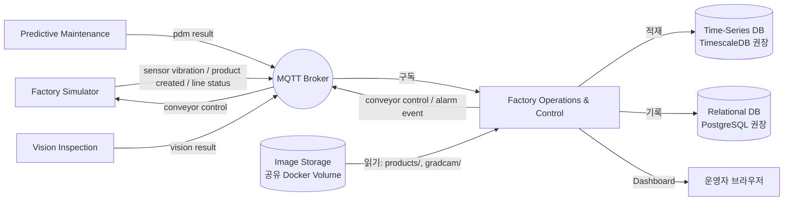
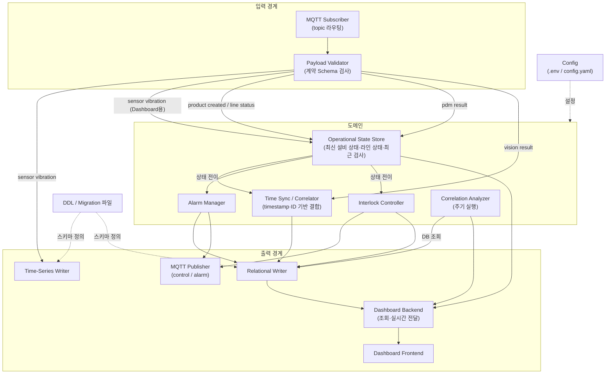
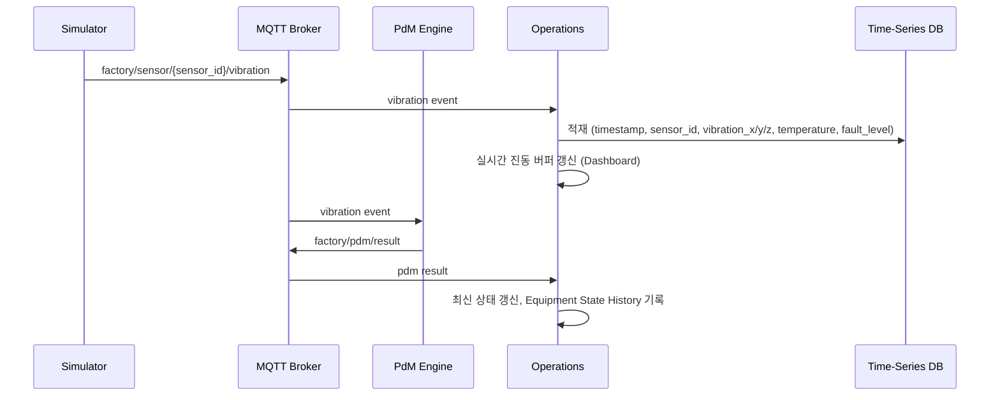
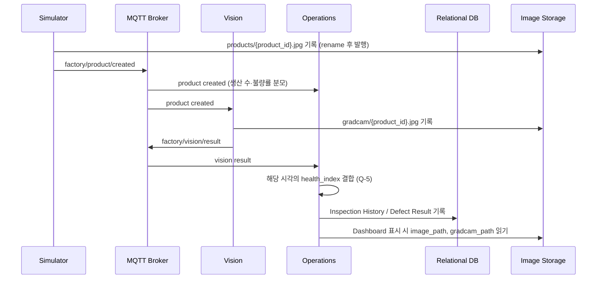
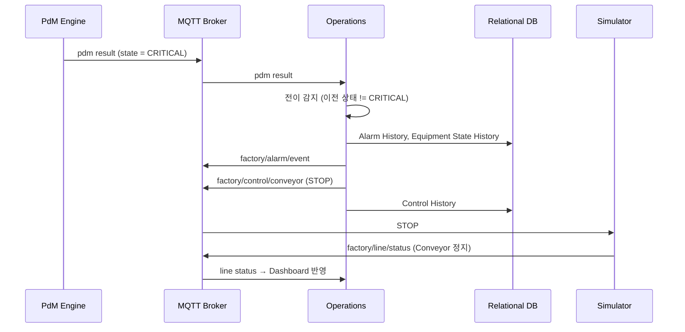

# Factory Operations & Control — Component Architecture (초안)

> 상태: **초안(Draft)**. 사람 리뷰 전이며 구현 기준 문서가 아니다.
> 이 문서는 Shared 계약을 **참고로만** 읽고 작성했다. `SHARED_CONFIG.json`의 `contract_ref`가 `null`(계약 미채택)이므로, 아래 "Shared 근거"는 채택된 계약이 아니라 기록된 commit의 참고 내용이다. 계약이 채택되면 그 `contract_ref`로 다시 대조한다.

## 0. 읽은 기준과 표기

### 0.1 Shared 참고 기준

| 항목 | 값 |
|---|---|
| Shared 저장소 | `dltndn-personal-project/smart-factory-shared-repository` (원격, GitHub Contents API) |
| `contract_ref` | `null` — 계약 미채택. `agent/core/process/90-shared.md` 1절에 따라 구현 기준으로 쓰지 않음 |
| 읽은 ref | 원격 기본 브랜치 `main`의 commit `6bcd2aad8e374a7e96f816051585a49cb5e30f86` (2026-09-24T02:11:37Z 고정, 90-shared.md 2절 방식) |
| 읽은 문서 | `docs/ARCHITECTURE.md`, `docs/INTERFACES.md`, `docs/CONVENTIONS.md` |
| 읽지 않은 것 | Shared Issue 목록·본문 (AGENTS.md: 일반 작업에서 조회하지 않음), 로컬 `../shared-repository/` 폴더 (원본으로 쓰지 않음) |

참고: 이 commit은 현재 `process_ref`와 같은 commit이다.

### 0.2 표기

- **[확정]** Shared 문서에 근거가 있는 내용. 괄호 안에 출처 절을 적는다. 예: (ARCH 4.4) = Shared `docs/ARCHITECTURE.md` 4.4절, (IF) = `docs/INTERFACES.md`, (CONV) = `docs/CONVENTIONS.md`.
  단, Shared 문서 자체가 "후보"나 "미정"이라고 적은 항목은 [확정]으로 표시하지 않는다.
- **[가정]** Shared에 근거가 없어 이 문서가 임시로 두는 설계 선택. 리뷰나 Shared 결정으로 바뀔 수 있다.
- **[미정]** 결정되지 않았고 이 문서도 가정을 두지 않은 항목. 11절에 질문으로 정리했다.

---

## 1. 목적과 역할

Factory Operations & Control(이하 Operations)은 Smart Factory System의 **중앙 운영 Component**다. PdM과 Vision의 분석 결과와 Simulator의 설비·생산 이벤트를 수집해 공장 운영 상태를 관리하고, **생산라인 제어 권한**을 가진다. [확정] (ARCH 4.4)

> Integration + Monitoring + Decision + Control (ARCH 4.4)
> Factory Operations & Control = Integration, Monitoring & Control (ARCH 18)

여기서 Integration은 **Runtime 데이터 통합**이다. 저장소 조합·호환성 검증을 하는 `integration` 저장소와는 다른 책임이며, 두 책임을 한 저장소에 두지 않는다. [확정] (ARCH 19.1)

---

## 2. 책임 범위와 경계

### 2.1 책임 (하는 일)

| 영역 | 내용 | 근거 |
|---|---|---|
| 데이터 통합 | Simulator(설비 상태, 센서 데이터, 생산 상태, 제품 생성 이벤트), PdM(Anomaly Score, Health Index, Equipment State), Vision(Defect 여부, Defect Type, Confidence, BBox, Image/Grad-CAM Reference)을 MQTT로 수신해 통합 | [확정] ARCH 4.4 Data Integration |
| 시간 동기화 | UTC ISO 8601 timestamp와 `timestamp`·`sensor_id`·`product_id`·production sequence로 OT 데이터와 품질 데이터를 연결 | [확정] ARCH 4.4 Time Synchronization, 9, 17 |
| 상관분석 | 설비 진동과 제품 불량 빈도의 관계 분석 (Pearson, Spearman, Time Lag 중 선택), Dashboard로 시각화 | [확정] ARCH 4.4 Correlation Analysis, 17 |
| Alarm 관리 | Equipment State 변화에서 Alarm 생성. WARNING·CRITICAL은 반드시 Alarm. Alarm History를 DB에 저장 | [확정] ARCH 4.4 Alarm Management, 17 |
| Interlock 제어 | Equipment State가 CRITICAL이면 STOP 명령을 MQTT로 발행해 라인 자동 정지. 라인 정지 최종 결정 권한은 Operations만 가짐 | [확정] ARCH 4.4 Interlock Control, 7.3, 17 |
| Dashboard | 실시간 통합 관제 Dashboard 제공, 5초 이내 갱신 | [확정] ARCH 2, 4.4 Dashboard, 17 |
| 데이터 영속화 | Time-Series DB·Relational DB의 테이블 스키마(DDL) 소유, DB에 기록하는 **유일한** Component | [확정] ARCH 4.4 Data Persistence, 5.2, 5.3, 17 |
| 평가용 Ground Truth 사용 | Ground Truth는 평가 용도로만 사용 ("Evaluation Only") | [확정] ARCH 17 |

### 2.2 하지 않는 일

| 하지 않는 일 | 담당 | 근거 |
|---|---|---|
| FFT, Feature Extraction, Autoencoder, Health Index 계산 | PdM (Operations는 결과를 Consume) | [확정] ARCH 3.1, 10, 17 |
| Defect Detection, Grad-CAM 생성 | Vision (Operations는 결과를 Consume) | [확정] ARCH 17 |
| Fault Injection, 센서·제품·이미지 생성 | Simulator | [확정] ARCH 4.1, 17 |
| Conveyor 물리적 정지 | Simulator (Operations는 Command만 발행) | [확정] ARCH 17 |
| 3D Factory Visualization | Simulator (Operations는 "Dashboard Only") | [확정] ARCH 17 |
| 다른 Component 함수 직접 호출·코드 의존 | 금지. MQTT로만 연동 | [확정] ARCH 3.2, 10 |
| Shared Infrastructure 실행 정의(Broker·DB·볼륨 구성), Component 조합 검증, 시스템 수준 성능 측정 | `integration` | [확정] ARCH 19.1 |
| 이미지 파일 기록 | Simulator(`products/`), Vision(`gradcam/`). Operations는 읽기만 | [확정] IF Image Reference |
| Ground Truth(`fault_level` 등)를 판단 입력으로 사용 | 금지. Interlock·Alarm은 PdM의 Equipment State로만 판단 | [확정] ARCH 3.4, 8 / [가정] Interlock에 적용하는 해석 |
| Production 수준 기능: 멱등성, 중복 제거, Retry/Recovery, HA/Failover, 인증/인가, 암호화, 백업 | 범위 밖 | [확정] ARCH 2, 12, 13 |

### 2.3 소유하는 데이터·자원

- Time-Series DB 테이블 정의와 센서 데이터 적재 [확정] (ARCH 5.2)
- Relational DB 테이블 정의와 Inspection History, Defect Result, Alarm History, Equipment State History, Control History 기록 [확정] (ARCH 4.4, 5.3)
- `health_index_at_time`처럼 PdM과 Vision 결과를 결합한 필드 [확정] (ARCH 4.4)
- DDL 파일: `integration`이 `COMPOSITION.json`에 고정한 `factory-operations` commit의 DDL로 DB를 초기화한다 [확정] (ARCH 19.1). 저장소 안의 DDL 경로는 [미정] (Q-12)
- Alarm Event, Conveyor Control 메시지의 **생산자** [확정 아님: IF 후보] (IF)

---

## 3. 시스템 컨텍스트



근거: ARCH 4.4, 5, 6, 7 / IF Interface 후보 표, Image Reference. Dashboard와 운영자 브라우저의 연결 방식은 [미정] (9절).

---

## 4. 내부 구성요소

저장소에는 아직 제품 코드가 없다(현재 `agent/`, `docs/`, 설정 파일만 있음). 아래 모듈 분해는 **[가정]**이며, Shared가 정한 책임(2.1절)을 코드 경계로 옮긴 것이다. 모듈 간 호출은 같은 프로세스 안의 호출이며, 다른 Component와는 MQTT로만 연결한다(ARCH 10).

### 4.1 모듈 구조



| 모듈 | 책임 | 근거 / 상태 |
|---|---|---|
| MQTT Subscriber | 6.1절의 구독 topic을 구독하고 메시지를 종류별로 라우팅 | ARCH 3.2, 5.1 / 모듈화는 [가정] |
| Payload Validator | 계약 JSON Schema로 검사, 위반은 로그 후 폐기 | Schema 자체는 [미정] (IF). 폐기 정책은 [가정] |
| Operational State Store | `sensor_id`별 최신 Equipment State·Health Index, 라인 상태(Conveyor, Fault Level), 최근 검사 결과, 실시간 진동 버퍼를 메모리에 유지 | [가정] |
| Time Sync / Correlator | Vision 결과를 해당 시각의 설비 상태와 결합해 `health_index_at_time` 등을 채움 | [확정] ARCH 4.4, 5.3. 결합 규칙은 [미정] (Q-5) |
| Alarm Manager | Equipment State 전이 감지, Alarm 생성·저장·발행 | [확정] ARCH 4.4. 전이 규칙 세부는 [가정] (6.3절) |
| Interlock Controller | CRITICAL 진입 시 STOP 명령 생성, Control History 기록 | [확정] ARCH 4.4, 7.3. 재가동 규칙은 [미정] (Q-7) |
| Correlation Analyzer | 설비 진동 지표와 불량 빈도의 상관계수·Time Lag 계산 | [확정] ARCH 4.4. 지표·윈도는 [미정] (Q-4) |
| MQTT Publisher | Conveyor Control, Alarm Event 발행 | [확정] ARCH 4.4, 7.3 / topic은 IF 후보 |
| Time-Series Writer | 센서 이벤트를 Time-Series DB에 적재 | [확정] ARCH 5.2, 7.1 |
| Relational Writer | Inspection·Defect·Alarm·Equipment State·Control History 기록 | [확정] ARCH 5.3 |
| Dashboard Backend / Frontend | 5초 이내 갱신되는 관제 화면, 이미지·Grad-CAM 표시 | [확정] ARCH 4.4. 구현 방식은 [미정] (9절). FFT Spectrum 출처는 [미정] (Q-9) |
| DDL / Migration | DB 테이블 정의. `integration`이 DB 초기화에 사용 | [확정] ARCH 19.1. 경로·형식은 [미정] (Q-12) |
| Config | Broker URL, DB URL, Image root, Threshold, Topic Name 등 외부화 | [확정] ARCH 14, CONV |

### 4.2 저장소 디렉터리 구조

[가정] 기술 스택(9절)이 정해지면 확정한다. task `scope` glob의 기준이 되므로 확정 시 `docs/COMPONENT.md` "구조" 절에 옮긴다.

```text
factory-operations/
├─ docs/                 # COMPONENT.md, ARCHITECTURE.md
├─ db/                   # DDL (Time-Series, Relational) — 경로는 integration과 합의 필요 (Q-12)
├─ src/                  # 수집·도메인·출력 모듈 (4.1절)
├─ dashboard/            # Dashboard Frontend (Backend와 분리 여부 미정)
├─ config/               # 설정 예시 (.env.example, config.example.yaml). 실제 .env는 commit하지 않음 (CONV)
├─ tests/
└─ agent/                # agent 절차·상태 (기존)
```

---

## 5. 데이터 흐름

### 5.1 센서 데이터 흐름 (ARCH 7.1)



### 5.2 Vision 검사 흐름 (ARCH 7.2)



### 5.3 생산 제어(Interlock) 흐름 (ARCH 4.4, 7.3)



Line Status로 명령 결과를 확인하는 부분은 IF 후보의 설명에 근거한다. Line Status는 ARCH 5.1 Topic 구조에는 없고 IF 후보에만 있다.

---

## 6. 외부 인터페이스와 Shared 계약 매핑

> INTERFACES 문서에는 **승인된 Interface가 아직 없다**. 아래 topic은 모두 "후보"이며 Payload Schema는 [미정]이다 (IF). 따라서 이 절의 필드 목록은 ARCH의 "대표적인 출력 구조"와 "최소 데이터"에서 옮긴 **참고 필드**이고, 계약이 아니다.

### 6.1 구독 (Consume)

| Interface | MQTT Topic (후보) | 생산자 | Operations에서의 용도 | 참고 필드 (ARCH 예시) | 근거 |
|---|---|---|---|---|---|
| Sensor Vibration | `factory/sensor/<sensor_id>/vibration` (구독 시 `factory/sensor/+/vibration` [가정]) | factory-simulator | Time-Series DB 적재, 실시간 진동 표시 | `timestamp`, `sensor_id`, `vibration_x`, `vibration_y`, `vibration_z`, `temperature`, `fault_level` | ARCH 4.1, 5.2, 7.1 / IF |
| Product Created | `factory/product/created` | factory-simulator | 생산 수 집계(불량률 분모), 제품 ↔ 시각 연결 | `product_id`, `timestamp`, `image_path` | ARCH 3.3, 4.3, 7.2 / IF |
| PdM Result | `factory/pdm/result` | predictive-maintenance | 설비 상태 표시, Alarm, Interlock, State History, 상관분석 | `timestamp`, `sensor_id`, `anomaly_score`, `health_index`(0~100), `state` | ARCH 4.2, 7.1, 7.3 / IF |
| Vision Result | `factory/vision/result` | vision-inspection | Inspection/Defect History, 불량률, 상관분석, 최근 검사 표시 | `product_id`, `timestamp`, `defect`, `defect_type`, `confidence`, `bbox`, `image_path`, `gradcam_path` | ARCH 4.3, 7.2 / IF |
| Line Status | `factory/line/status` | factory-simulator | Conveyor Status, 현재 Fault Level, 생산 진행 표시, STOP 결과 확인 | [미정] | IF (ARCH 5.1에는 없음) |

### 6.2 발행 (Produce)

| Interface | MQTT Topic (후보) | 소비자 | 발행 조건 | Payload | 근거 |
|---|---|---|---|---|---|
| Conveyor Control | `factory/control/conveyor` | factory-simulator | Equipment State가 CRITICAL에 도달 (STOP). 재가동(START 등) 조건은 [미정] | [미정]. [가정] 최소 `timestamp`, `command`, 원인(`sensor_id`, 원인 PdM 결과의 `timestamp`) | ARCH 4.4, 7.3 / IF |
| Alarm Event | `factory/alarm/event` | **[미정]** (IF 후보에서 소비자 미정) | WARNING·CRITICAL 진입 시 반드시, 그 외 전이는 선택 | [미정]. [가정] 최소 `timestamp`, `sensor_id`, `from_state`, `to_state`, `severity` | ARCH 4.4 / IF |

### 6.3 판단 규칙

| 규칙 | 내용 | 상태 |
|---|---|---|
| Equipment State 값 | `NORMAL`, `CAUTION`, `WARNING`, `CRITICAL`. Health Index 80~100/60~79/40~59/0~39에 대응 | 값 집합 [확정] (ARCH 4.2, CONV). 대소문자 표기는 INTERFACES에서 확정 예정 [미정] (CONV) |
| 상태 산출 | Operations는 Health Index로 상태를 다시 계산하지 않고 PdM의 `state`를 그대로 사용 | [가정] (Health Index 계산이 PdM 책임이므로, ARCH 17) |
| Interlock | `state == CRITICAL` → STOP | [확정] (ARCH 4.4) |
| Interlock 발동 시점 | 다른 상태에서 CRITICAL로 **전이**할 때 1회 STOP 발행. CRITICAL이 연속 수신되어도 반복 발행하지 않음 | [가정] |
| Interlock 해제·재가동 | 누가, 어떤 조건으로 라인을 재가동하는지 | [미정] (Q-7) |
| Alarm 생성 | `sensor_id`별 상태 전이 시 생성. WARNING·CRITICAL 진입은 필수, CAUTION 진입과 회복 방향 전이는 선택 | 필수 대상 [확정] (ARCH 4.4) / 전이 기준은 [가정] |
| Alarm 확인(ack)·해제 | 운영자 확인, 해제 상태 관리 | [미정] (Q-8). 초기 구현에서는 두지 않음 [가정] |
| 다수 `sensor_id` | 어떤 센서든 CRITICAL이면 라인 전체 STOP | [가정]. 라인·센서 수와 대응 관계는 [미정] (Q-6) |

### 6.4 Timestamp 정책 (ARCH 4.4, 9 / CONV Timestamp)

- 형식: UTC, ISO 8601, `Z` 접미사. 예 `2026-09-09T05:20:13.425Z` [확정]
- 기준: 로컬 시스템 시간이 아니라 **이벤트 발생 시각** [확정]
- 수신한 메시지의 `timestamp`는 변경 없이 저장·전달한다 (Simulator 생성, 하위 Component 유지) [확정] (CONV, ARCH 17)
- 소수점 자릿수(밀리초 고정 여부) [미정] (CONV). 파서는 소수점 유무를 모두 허용한다 [가정]
- OT 데이터와 Vision 데이터 결합에 이 timestamp를 사용한다 [확정] (ARCH 9)
- Operations가 **스스로 생성하는** 이벤트(Alarm, Control Command)의 timestamp 기준 [미정] (Q-3). [가정] 원인 이벤트의 timestamp를 별도 필드로 함께 싣고, 메시지 자체의 `timestamp`는 Operations의 판단 시각(UTC)으로 한다
- 수신 시각(Operations 로컬 시간)은 관측용으로만 따로 기록할 수 있으며, 결합 기준으로 쓰지 않는다 [가정]

### 6.5 ID 정책 (ARCH 11 / CONV ID)

| ID | 형식 | Operations 사용 | 상태 |
|---|---|---|---|
| `sensor_id` | 예 `motor01`. 형식·유일성 범위 미정 | PdM 결과·센서 데이터 결합, 상태 저장 키, Alarm 대상 | 형식 [미정] (CONV) |
| `product_id` | `P-` + 8자리 10진수, `^P-[0-9]{8}$` | Product Created ↔ Vision Result 결합, Inspection History 키 | 형식 [확정] (CONV). 유일성 범위 [미정] (Q-10) |
| production sequence | 미정 | 제품 ↔ 설비 데이터 연결 | [미정] (CONV, Q-10) |

- Vision 결과는 가능한 한 `product_id`를 포함한다 [확정] (ARCH 11). `product_id`가 없는 Vision 결과의 처리 [미정]. [가정] 기록은 하되 결합 필드는 비움.
- 유효성 검사는 계약 형식에만 적용하고, 위반 시 로그 후 폐기한다 [가정].

### 6.6 Ground Truth (ARCH 3.4, 8, 17 / CONV Ground Truth)

- Sensor 이벤트와 Line Status의 `fault_level`은 **Dashboard 표시·저장·평가 용도**로만 쓴다 [확정] (IF Line Status 설명, ARCH 17 "Evaluation Only").
- Interlock·Alarm 판단과 상관분석의 설비 지표에 `fault_level`을 쓰지 않는다 [가정: ARCH 8을 Operations 판단에 적용한 해석]. 평가 목적의 "Fault Level ↔ 불량률" 비교 화면을 둘지는 [미정] (Q-4).
- Operations는 AI 추론 입력 Payload를 발행하지 않으므로 Ground Truth 미포함 규칙의 직접 대상은 아니다.

### 6.7 Image Reference (IF Image Reference, ARCH 5.4)

- Operations는 `products/`, `gradcam/`을 **읽기만** 한다 [확정].
- MQTT의 `image_path`, `gradcam_path`는 Image Storage 루트 기준 상대 경로다. 루트 절대 경로는 설정(`IMAGE_ROOT` 등)으로 받는다 [확정] (IF, CONV).
- 이벤트 수신 시점에 파일은 완성되어 있다고 가정한다 [확정] (IF 발행 전제).
- Dashboard 브라우저가 이미지를 받는 방식(Backend가 볼륨을 읽어 제공 등) [가정: Backend 경유 제공]. 볼륨 정의는 `integration` 소유 [확정] (IF).

---

## 7. 저장소와 상태 관리

### 7.1 데이터베이스 (ARCH 4.4 Data Persistence, 5.2, 5.3)

| 저장소 | 권장 제품 | 내용 | 상태 |
|---|---|---|---|
| Time-Series DB | TimescaleDB | 센서 시계열. 최소 `timestamp`, `sensor_id`, `vibration_x`, `vibration_y`, `vibration_z`, `temperature`, `fault_level` | 제품은 "권장" [확정], 최소 필드 [확정] |
| Relational DB | PostgreSQL | Inspection History, Defect Result, Alarm History, Equipment State History, Control History | 대상 목록 [확정] |

Vision Inspection 최소 필드 [확정] (ARCH 5.3): `id`, `timestamp`, `product_id`, `image_path`, `defect_type`, `confidence`, `bbox`, `health_index_at_time`.

[가정] 추가로 둘 필드와 테이블:

- Inspection: `defect`(bool), `gradcam_path`, `sensor_id`(결합에 쓴 설비), `anomaly_score_at_time`
- Equipment State History: `timestamp`, `sensor_id`, `anomaly_score`, `health_index`, `state`
- Alarm History: `id`, `timestamp`, `sensor_id`, `from_state`, `to_state`, `severity`, `source_timestamp`
- Control History: `id`, `timestamp`, `command`, `reason`, `sensor_id`, `source_timestamp`
- Product(생산 이벤트): `product_id`, `timestamp`, `image_path` — 불량률 분모 산출용

미정: TimescaleDB와 PostgreSQL을 같은 인스턴스(TimescaleDB 확장)로 둘지 분리할지 (Q-11), Defect Result를 Inspection History와 별도 테이블로 둘지 (Q-11), DDL 형식과 migration 도구 (Q-12).

### 7.2 메모리 상태

[가정] Operations 프로세스는 다음을 메모리에 둔다.

- `sensor_id`별 최신 PdM 결과(상태 전이 판정과 `health_index_at_time` 결합용)
- 최신 Line Status(Conveyor 상태, Fault Level)
- Interlock 상태(마지막 STOP 발행 여부)
- Dashboard 실시간 진동 표시용 짧은 링 버퍼

재시작 시 메모리 상태는 사라진다. 최신 설비 상태는 Equipment State History의 마지막 행으로 복원할 수 있으나, 자동 복구는 범위 밖이다 (ARCH 12).

---

## 8. 배포·실행 형태

| 항목 | 내용 | 상태 |
|---|---|---|
| 실행 환경 | 로컬 개발·데모 환경 | [확정] (ARCH 2, 13) |
| Shared Infrastructure 실행 정의 | MQTT Broker, TimescaleDB, PostgreSQL, Image Storage 볼륨 구성은 `integration`이 소유 | [확정] (ARCH 19.1) |
| DB 초기화 | `integration`이 고정된 `factory-operations` commit의 DDL로 수행 | [확정] (ARCH 19.1) |
| 공통 실행 방식 | Docker Compose 등 | [미정] (CONV) |
| 프로세스 구성 | 수집·판단·DB 기록을 담당하는 서비스 1개 + Dashboard. Dashboard를 같은 프로세스로 둘지는 스택 결정 후 확정 | [가정] |
| 이미지 볼륨 | 공유 Docker Volume을 Operations 컨테이너에 읽기 전용으로 마운트 | 공유 볼륨 [확정] (IF) / 읽기 전용 마운트 [가정] |
| 설정 | `.env` 또는 `config.yaml`. IP·Port·Broker URL·DB URL·Image Directory·Threshold·Topic Name 하드코딩 금지. 실제 `.env`는 commit하지 않음 | [확정] (ARCH 13, 14, CONV) |
| 이미지 배포 단위 | 컨테이너 이미지 digest 또는 commit으로 `COMPOSITION.json`에 고정 | [확정] (ARCH 19.1 / 90-shared.md 8절) |

---

## 9. 기술 스택

| 영역 | 선택 | 상태 |
|---|---|---|
| MQTT Broker | Eclipse Mosquitto | "권장" [확정] (ARCH 5.1) |
| Time-Series DB | TimescaleDB | "권장" [확정] (ARCH 5.2) |
| Relational DB | PostgreSQL | "권장" [확정] (ARCH 5.3) |
| 메시지 형식 | JSON (MQTT Payload) | [확정] (ARCH 10 "JSON Schema") |
| Schema 검증 방식 | JSON Schema 문서 기반 검사 | 계약 형태 [확정] (ARCH 10) / 검증 라이브러리 [미정] |
| 서비스 언어·프레임워크 | — | [미정]. Shared에 근거 없음 |
| MQTT Client 라이브러리 | — | [미정] |
| Dashboard 프레임워크·실시간 전달(WebSocket/SSE/polling) | — | [미정] (11.2) |
| 상관분석 라이브러리 | — | [미정] |
| 테스트·lint 도구 | — | [미정]. 정해지면 `agent/config.yaml` `verify`에 실제 실행한 명령만 추가 (10-bootstrap.md) |
| 컨테이너·실행 | Docker Compose 등 | [미정] (CONV) |

---

## 10. 비기능 요구사항, 오류 처리, 관측성

### 10.1 비기능 요구사항

| 항목 | 기준 | 근거 |
|---|---|---|
| Dashboard 갱신 | **최대 5초 이내** 갱신. 과제 평가 대상으로 반드시 충족·측정 | [확정] (ARCH 2, 4.4) |
| 측정 주체 | 시스템 수준 측정은 `integration`. Operations는 측정 가능한 지점(메시지 수신 시각, 화면 반영 시각)을 제공 | 측정 주체 [확정] (ARCH 19.1) / 측정 지점 [가정] |
| Interlock 지연 | CRITICAL 수신부터 STOP 발행까지의 목표 시간 | [미정] (Shared에 수치 없음, Q-7) |
| 처리량 | 센서 샘플링 주기·센서 수에 따른 Time-Series 적재량 | [미정] (Sampling Rate는 설정값, ARCH 14). 적재 방식(배치 여부)은 수치 확정 후 결정 |
| 범위 밖 | 성능 최적화, 확장성, HA, Failover, 멱등성, 중복 제거, 보안, 백업 | [확정] (ARCH 2, 12, 13) |

### 10.2 오류 처리

정상 Happy Path를 전제로 하며 Production 수준 복구 체계는 두지 않는다 [확정] (ARCH 12). 최소한의 오류 로그와 예외 처리만 적용한다.

| 상황 | 처리 | 상태 |
|---|---|---|
| JSON 파싱 실패, Schema 위반, ID·timestamp 형식 위반 | 로그 기록 후 해당 메시지 폐기, 처리 계속 | [가정] |
| 알 수 없는 `state` 값 | 로그 후 폐기. Interlock·Alarm 판단에 쓰지 않음 | [가정] |
| DB 쓰기 실패 | 로그 기록. 재시도·재처리 Queue 없음 | 재시도 없음 [확정] (ARCH 12) / 로그 [가정] |
| Broker·DB 연결 끊김 | 별도 설계 없음. 수동 재시작 | [확정] (ARCH 12) |
| 중복·순서 역전 메시지 | 별도 처리 없음. 상태 전이는 수신 순서로 판정 | 처리 안 함 [확정] (ARCH 3.2, 12) / 수신 순서 판정 [가정] |
| 이미지 파일 없음 | Dashboard에 "이미지 없음" 표시, 로그 | [가정] |
| 오류 표현 형식 | — | [미정] (CONV) |

### 10.3 관측성

- 구조화 로그(메시지 수신·폐기 사유, Alarm 생성, STOP 발행, DB 쓰기 오류) [가정]
- Dashboard 갱신 주기 측정을 위한 타이밍 로그 또는 지표 [가정]. `integration`의 5초 측정에 필요한 형식은 [미정] (Q-13)
- Security Monitoring, Production 모니터링 스택은 두지 않는다 [확정] (ARCH 13)

---

## 11. 미결 사항과 Shared 제기 필요 질문

이 문서에서 Shared 계약이나 다른 Component를 수정하지 않았다. 아래는 Shared(계약 변경 승인 책임자, ARCH 19)에 제기할 후보다. 게시는 사용자 요청 시 `90-shared.md` 5절 절차로 한다.

### 11.1 Shared 제기 필요

| ID | 질문 | 관련 | 이유 |
|---|---|---|---|
| Q-1 | 이 Component가 구현 기준으로 채택할 `contract_ref`는 언제, 어느 commit인가? | SHARED_CONFIG, IF | 현재 `null`이라 계약 의존 구현을 시작할 수 없음 |
| Q-2 | 각 Interface(Sensor Vibration, Product Created, PdM Result, Vision Result, Line Status, Conveyor Control, Alarm Event)의 JSON Schema, 필수/선택 필드, 단위, QoS·retain 여부는? | IF "작성 항목", CONV 물리 단위 | Validator와 DDL이 여기에 의존 |
| Q-3 | Operations가 생성하는 Alarm·Control 메시지의 `timestamp`는 판단 시각인가, 원인 이벤트의 시각인가? 원인 timestamp 필드를 별도로 두는가? 밀리초 자릿수는 고정인가? | ARCH 9, CONV Timestamp | "이벤트 발생 시각" 규칙을 Operations 생성 이벤트에 적용하는 방법이 없음 |
| Q-4 | 상관분석의 "설비 진동" 지표는 무엇인가? (PdM의 `anomaly_score`/`health_index`만 쓰는가, Operations가 raw 진동의 단순 통계(RMS 등)를 계산해도 되는가?) 불량 빈도의 집계 윈도와 Time Lag 범위는? `fault_level` 기반 평가 화면을 허용하는가? | ARCH 4.4, 17 | raw 진동 통계 계산은 PdM의 Feature Extraction 책임(17)과 겹칠 수 있음 |
| Q-5 | Vision 결과와 설비 상태의 결합 규칙: 제품을 어느 `sensor_id`에 대응시키는가? `health_index_at_time`은 Vision `timestamp` 이전 최신 PdM 결과인가, Product Created 시각 기준인가? 허용 시간 차는? | ARCH 4.4 Time Synchronization, 5.3 | 결합 기준이 정의되지 않음 |
| Q-6 | 생산 라인과 `sensor_id`의 수·대응 관계는? (단일 라인·단일 모터 `motor01` 전제인가) | ARCH 11, CONV ID | Interlock 대상 범위와 Conveyor Control Payload에 필요 |
| Q-7 | Interlock 이후 재가동(START/RESET) 명령은 존재하는가? 누가(운영자 Dashboard 조작, 자동 회복) 어떤 조건으로 내리는가? Conveyor Control 명령 값 집합과 Interlock 지연 목표는? | ARCH 4.4 Interlock, 16 "Conveyor Start / Stop Control" | STOP만 정의되어 있음 |
| Q-8 | Alarm Event의 소비자는 누구인가? Alarm 확인(ack)·해제 상태가 필요한가? CAUTION 진입과 회복 전이도 Alarm인가? | IF (소비자 미정), ARCH 4.4 | 발행 필요성과 Payload가 소비자에 따라 달라짐 |
| Q-9 | Dashboard의 FFT Spectrum 데이터 출처는? Operations는 FFT를 하지 않으므로(ARCH 17) PdM Result에 스펙트럼을 포함하거나 별도 Topic이 필요한가? | ARCH 4.4 Dashboard, 17 | 최소 표시 항목인데 공급 Interface가 없음 |
| Q-10 | production sequence의 형식·생성 주체, `product_id` 유일성 범위(실행 단위 vs 전체), `sensor_id` 형식은? | CONV ID | 결합 키와 DB 키 설계에 필요 |
| Q-11 | TimescaleDB와 PostgreSQL은 한 인스턴스인가 별도인가? Defect Result는 Inspection History와 별도 엔터티인가? | ARCH 5, 5.2, 5.3 | DDL과 연결 설정 구조가 달라짐 |
| Q-12 | `integration`이 읽을 DDL의 저장소 내 경로·형식(순수 SQL, migration 도구)은? | ARCH 19.1 | `integration`과의 인터페이스. 합의 없이 정하면 조합 검증이 깨짐 |
| Q-13 | Dashboard 5초 갱신을 `integration`이 측정할 방법과 Operations가 제공할 지점(로그·지표 형식)은? | ARCH 2, 19.1 | 평가 대상 성능 기준 |
| Q-14 | Line Status가 ARCH 5.1 Topic 구조에 없는데, IF 후보 `factory/line/status`로 확정하는가? Current Fault Level은 Line Status와 Sensor 이벤트 중 어느 것을 기준으로 표시하는가? | ARCH 5.1, IF | 두 문서 간 차이, 같은 값의 출처 중복 |
| Q-15 | Equipment State 값의 대소문자 표기(`CRITICAL` vs `Critical`)는? | CONV, ARCH 4.2 표·예시 | ARCH 표는 `Critical`, 예시 JSON은 `CRITICAL` |

### 11.2 저장소 내부 미결 (Shared 제기 불필요)

- 서비스 언어·프레임워크, Dashboard 기술, 테스트·lint 도구 선정 (9절)
- 4.2절 디렉터리 구조 확정과 `docs/COMPONENT.md` "구조"·"용어"·"실행·검증 환경" 절 반영 (BOOT-1)
- `agent/config.yaml`의 `verify`에 넣을 실제 검증 명령 (BOOT-1)
- 이 문서의 [가정] 항목 리뷰

### 11.3 이 문서와 작업 절차의 관계

- 이 문서는 사용자의 직접 지시로 작성했으며 `agent/PLAN.yaml`의 task(`BOOT-1` scope: `docs/COMPONENT.md`, `agent/config.yaml`, `agent/PLAN.yaml`)에 포함되지 않는다.
- 계약이 채택(`contract_ref` 설정)되면 해당 commit으로 이 문서의 [확정] 표시와 출처 절을 다시 대조한다.
